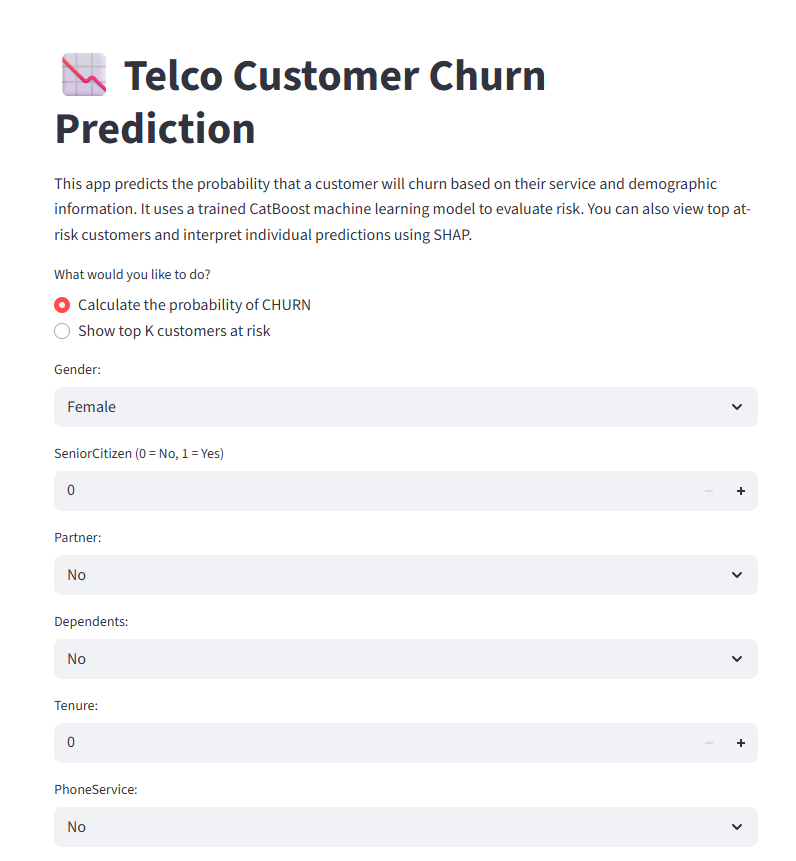
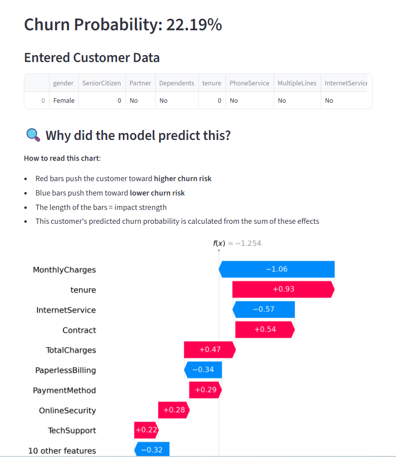
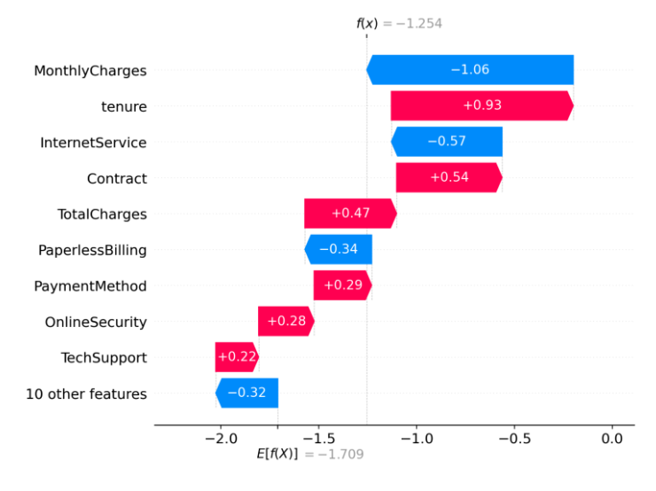
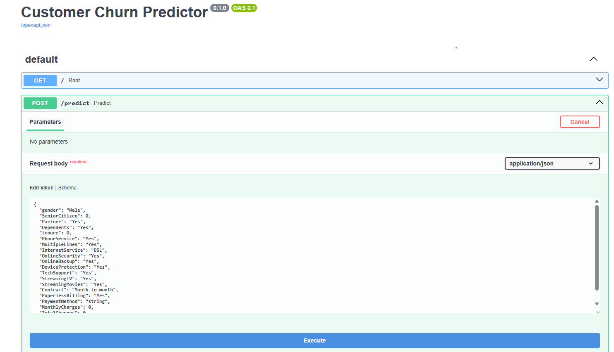
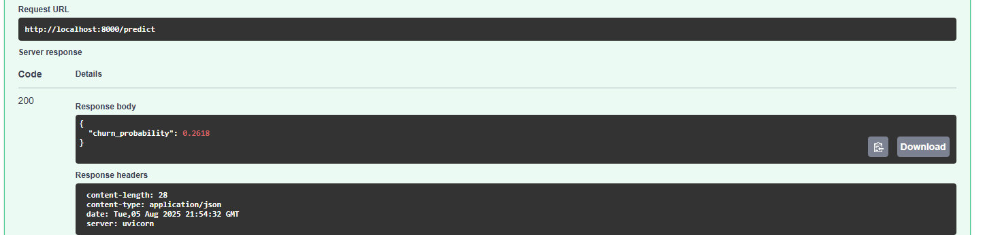

# 📉 Customer Churn Prediction with Streamlit, FastAPI, and CatBoost

This project predicts the likelihood of a customer churning based on service usage patterns and demographic data. It features:

- 🧠 A CatBoost classification model
- 🌐 A REST API built with FastAPI
- 🖥️ A user-friendly frontend using Streamlit
- 📊 SHAP explainability to interpret predictions
- 🐳 Containerized with Docker for easy deployment

---

## 🚀 Demo Features

- 🔍 Predict churn probability for an individual customer
- 📈 Explain each prediction using SHAP waterfall plots
- 📋 Display top-K customers most at risk of churning
- 🧠 FastAPI backend with JSON-based prediction endpoint
- 🐳 Dockerized deployment with `docker-compose`

---

## 🧠 Model & Dataset

- Model: [CatBoostClassifier](https://catboost.ai)
- Dataset: [Telco Customer Churn](https://www.kaggle.com/datasets/blastchar/telco-customer-churn)

---

## 📦 Project Structure

```
customer_churn_project/
├── api/                     # FastAPI backend
│   ├── main.py
│   ├── predictor.py
│   └── schemas.py
│
├── streamlit_app/           # Streamlit frontend
│   └── app.py
│
├── model/                   # Trained model file
│   └── catboost_model.cbm
│
├── data/                    # Source CSV
│   └── WA_Fn-UseC_-Telco-Customer-Churn.csv
│
├── requirements.txt         # Python dependencies
├── Dockerfile               # Docker image
├── docker-compose.yml       # Multi-service setup
└── README.md
```

---

## 🧪 Example API Call

### Endpoint:
```
POST /predict
```

### Body:
```json
{
  "gender": "Female",
  "SeniorCitizen": 0,
  "Partner": "Yes",
  "Dependents": "No",
  "tenure": 5,
  "PhoneService": "Yes",
  "MultipleLines": "No",
  "InternetService": "DSL",
  "OnlineSecurity": "Yes",
  "OnlineBackup": "No",
  "DeviceProtection": "Yes",
  "TechSupport": "No",
  "StreamingTV": "No",
  "StreamingMovies": "No",
  "Contract": "Month-to-month",
  "PaperlessBilling": "Yes",
  "PaymentMethod": "Mailed check",
  "MonthlyCharges": 75.5,
  "TotalCharges": 386.45
}
```

---

## 🐳 How to Run with Docker

### 1. Clone the repo
```bash
git clone https://github.com/nishat-meem/Customer-Churn-Prediction.git
cd Customer-Churn-Prediction
```

### 2. Build and run the containers
```bash
docker-compose up --build
```

### 3. Open in browser
- Streamlit: http://localhost:8501
- FastAPI docs: http://localhost:8000/docs

---

## 📌 Requirements (without Docker)

- Python 3.10+
- CatBoost
- FastAPI
- Streamlit
- Pandas
- SHAP
- Matplotlib

Install with:

```bash
pip install -r requirements.txt
```

---

## 🧠 SHAP Explainability

We use SHAP (SHapley Additive exPlanations) to explain why the model predicts a customer is likely to churn:

- 🔵 Blue: Factors reducing churn risk
- 🔴 Red: Factors increasing churn risk

Each customer gets a visual breakdown via waterfall plot.

---

## Some images from the project
### Streamlit



### API



